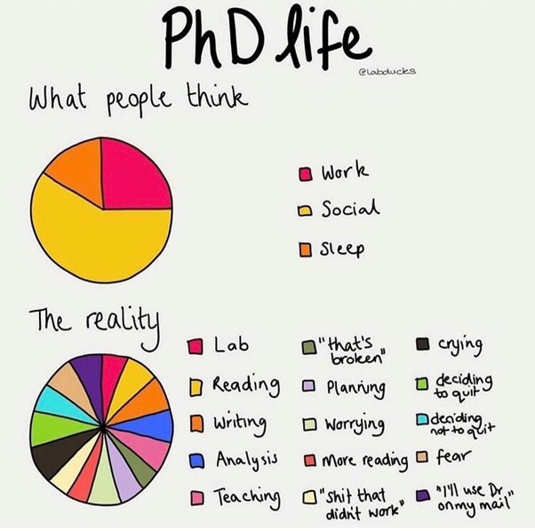

When I got the offer letter for the PhD program in the Department of Computer
Science and Engineering at Indian Institute of Technology Delhi, I felt *ecstatic*
— a sense of relief after a year of being unemployed.

But a quote from **[Dr. Arkaprava Basu](https://www.csa.iisc.ac.in/~arkapravab/)**,
shared during a conversation about working with him, quickly brought things back
to earth:

> "All of the educational programs deals with consuming knowledge but only PhD
> additionally involves generating knowledge."
>
> — **Dr. Arkaprava Basu**

I started scouring the internet for what I was actually getting into. A
[blog by **Dr. Joe Riad**](https://medium.com/@joeriad/a-phd-examined-introduction-c7a487f57ede)
hit closer to home than I expected. The core message: *take it one step at a
time, because this is a very long ride.* But what really stayed with me was the
part about **isolation** — how easy it is to slip into, especially for an
introvert. I recognised that pattern in myself immediately. The blog also made
a case for having outlets outside research, and I filed that away.

---

## Semester 1: New Territory

When the academic year started in late July 2025, there was a lot to navigate
at once — paperwork, meetings with professors, enrolling in courses, and getting
used to a new campus and city.

After several conversations with my now advisor,
**[Dr. Rijurekha Sen](https://www.cse.iitd.ac.in/~rijurekha/)**, I found myself
drawn to a project on **Privacy Preserving Machine Learning (PPML)** using
**Fully Homomorphic Encryption (FHE)**. 
**[Dr. Paarijaat Aditya](https://www.nokia.com/people/paarijaat-aditya/)**
from Nokia Bell Labs, Stuttgart, came on as my external co-advisor.

The early months were spent trying to understand the landscape — working with
FHE libraries, running experiments, benchmarking. What surprised me was how much
I enjoyed it. My previous job as an Associate Software Engineer had a *monotony*
I'd quietly made peace with. Research broke that completely. Every day brought
something new to learn or try. And on the days where it felt like nothing was
going anywhere, I reminded myself: *the blog had told me to expect exactly this.*

The first time I had to present what I'd been reading and thinking about to my
advisors, it did not go well. I tend to *speed up instinctively* when I talk,
jumping between topics before finishing the previous one, and in that meeting it
showed. I couldn't get across what I had in mind, and it *ended early*. I was
asked to put together a presentation — to structure what I had been trying to
explain. The next meeting went much better, and my advisors told me *this happens
to almost everyone* and that everyone gets better at it. I can mostly hold my own
now even without slides, but the speedup is something I am *still working on.*

Isolation had always been the path of least resistance for me, and initiating
conversation was genuinely hard — so I started therapy, partly as a response to
what I had read. Slowly, that began to shift. Peer discussions started feeling
less like an effort. By the end of the semester, at one of the informal dinners
the department holds for faculty and PhD students, I found myself talking to
professors with an ease I would not have had a few months earlier. The professors
shared their PhD and postdoc stories before the meal, and at the table I held
conversations instead of retreating. *It felt good.*

---

Image credit: [Cranfield University](https://blogs.cranfield.ac.uk/environmental-technology/why-doing-a-phd-is-not-a-waste-of-time/)

---

## Semester 2: Into the Thick of It

The second semester opened with a collaboration with a senior PhD student,
**[Dr. Mehreen Jabeen](https://www.linkedin.com/in/mehreen-jabeen-107819160/)**,
who had recently completed their defense. I ran experiments
for a paper they were working on — about five weeks of back-and-forth — after
which the paper was submitted and rejected. That didn't hit as hard as it might
have; my contribution had been a small, focused piece rather than the whole
thing. But it was a sharp introduction to the *brutality of the conference
circuit.* We revised and resubmitted; it is currently awaiting a response.

There was also a moment that stung more than I expected. I got an opportunity to
intern at Bell Labs in Stuttgart with **Dr. Aditya** and his team — and *cleared
the interview.* First international travel, and more researchers to work
alongside: I had *genuinely gotten my hopes up.* But the required leaves were
not possible until I clear my comprehensive exams, so I had to turn it down.
**Dr. Aditya** reassured me there would be other years, and I knew that was
true. *Knowing it didn't make it easier.*

On the research front, ideas I came up with turned out to have already been
published. The first time, I absorbed it. The second time, it stung. I could
rationalise it — I had been working in this domain for less than seven months;
of course there were people ahead — but **rationalisation and feeling are
different things.** I still have this urge to move faster on any idea I get,
knowing others have been working in the same space for much longer.

The TA work was the highlight of the semester. Working closely with
**[Dr. Abhilash Jindal](https://abhilash-jindal.com/)**
on setting exams and building the testing infrastructure, it
felt like I was *actually contributing to the course.* The discussions were
genuinely engaging; there is something that stays with you when you get to watch
a sharp mind work through a problem in real time. We built testing scripts and
autograders for a step-by-step student implementation of `xv6`, and when word
got back — *unofficially* — that students had found the setup well-made, it
meant more than I expected.

---

A year in, I am still figuring it out. The outlets I had filed away from
**Dr. Joe Riad's** blog turned into real things: live stand-up comedy shows, a
sci-fi novel I restarted and have now brought to nearly 200 pages, and a routine
of swimming, gym, and cycling around campus — *sometimes past midnight, just to
clear my head.*

I am grateful for the family and friends who showed up through all of it, but
especially through the lows.